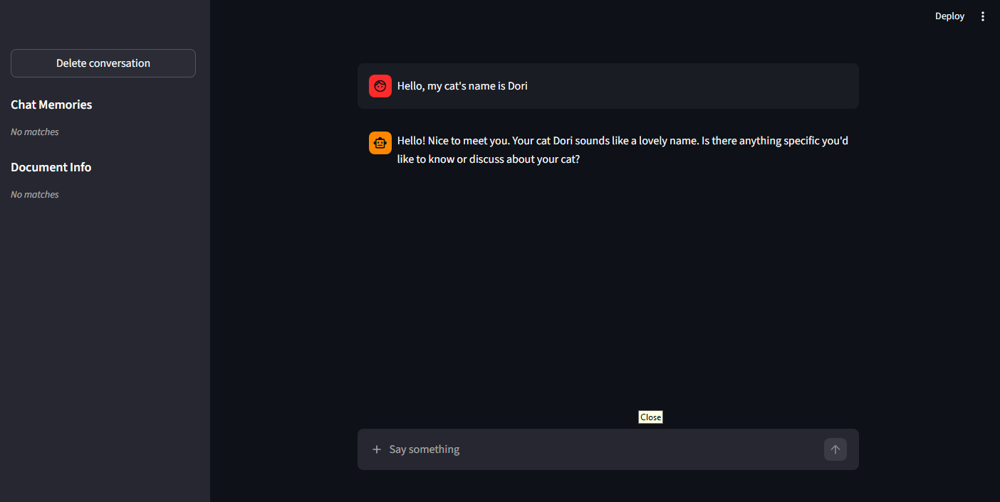
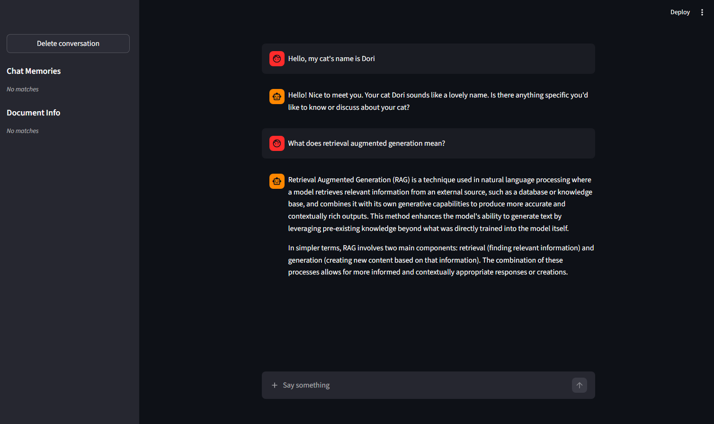
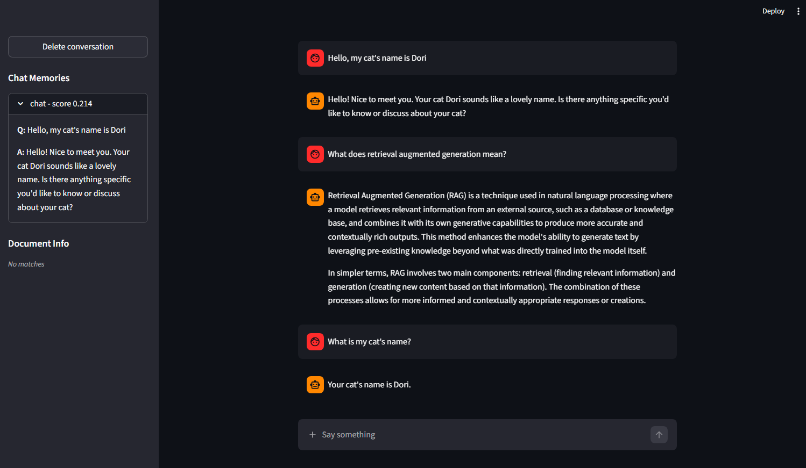
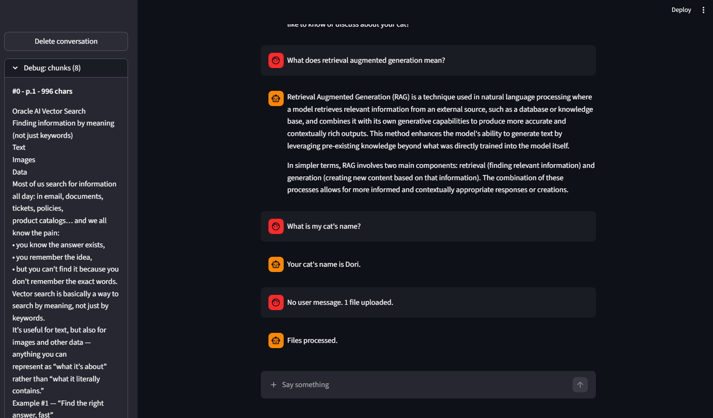
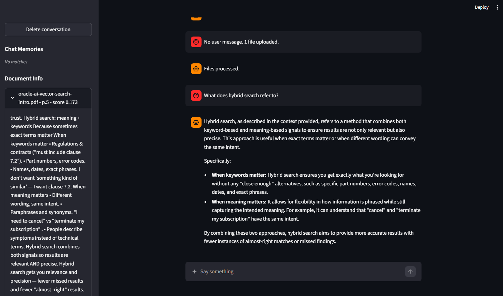
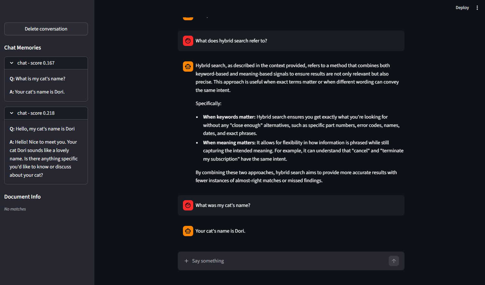

# TSBDTS Project

> Instructiuni de instalare si rulare: vezi [SETUP.md](SETUP.md).

## 1. Prezentare generala

Chatbot in Streamlit care:

- Primeste intrebari si, optional, PDF-uri in acelasi mesaj.
- Imparte PDF-urile in fragmente, le transforma in embeddings (`BAAI/bge-small-en-v1.5`) si le salveaza in Oracle 23ai pe coloane `VECTOR`.
- La fiecare intrebare, cauta in baza de date conversatiile si fragmentele cele mai apropiate semantic (`VECTOR_DISTANCE`), genereaza un prompt si il trimite la un LLM local (llama.cpp).
- Salveaza intrebarea si raspunsul inapoi in `chat_turns` pentru a putea fi folosite mai tarziu.

## 2. Arhitectura solutiei

Ce se intampla la trimiterea unui mesaj:

1. `app.py` preia textul si PDF-urile (optionale) din `st.chat_input`.
2. Daca exista PDF-uri, `file_helper` le imparte in fragmente, genereaza embeddings si `insert_doc_chunks` salveaza in `document_chunks`.
3. `fetch_records` cauta in `chat_turns` si `document_chunks` cele mai apropiate 2 randuri sub pragul de similaritate (`0.35`).
4. `generate_prompt` formateaza rezultatele in prompt sub `CHAT MEMORY:` si `DOCUMENT INFORMATION:`, apoi LLM-ul raspunde.
5. Intrebarea si raspunsul devin un nou rand in `chat_turns`.
6. UI-ul afiseaza raspunsul si arata in sidebar ce s-a recuperat, cu scor.

## 3. Modelul de date

Doua tabele separate, una pentru fragmente de PDF, alta pentru conversatii.

### `document_chunks`

| Coloana        | Tip                                                   | Rol                                                    |
| -------------- | ----------------------------------------------------- | ------------------------------------------------------ |
| `id`           | `NUMBER GENERATED BY DEFAULT AS IDENTITY PRIMARY KEY` | Cheie primara                                          |
| `file_name`    | `VARCHAR2(255)`                                       | Numele PDF-ului sursa                                  |
| `page`         | `NUMBER`                                              | Pagina pe care incepe primul caracter al fragmentului  |
| `text_content` | `CLOB`                                                | Textul fragmentului (~1000 caractere, suprapunere 100) |
| `embedding`    | `VECTOR(384, FLOAT32)`                                | Embedding corespunzator `text_content`                 |

### `chat_turns`

| Coloana        | Tip                                                   | Rol                                                            |
| -------------- | ----------------------------------------------------- | -------------------------------------------------------------- |
| `id`           | `NUMBER GENERATED BY DEFAULT AS IDENTITY PRIMARY KEY` | Cheie primara                                                  |
| `text_content` | `CLOB`                                                | `User: ... \nAssistant: ...` folosit ca sursa pentru embedding |
| `raw_question` | `CLOB`                                                | Intrebarea utilizatorului, salvat pentru afisare in sidebar    |
| `raw_response` | `CLOB`                                                | Raspunsul LLM-ului, salvat pentru afisare in sidebar           |
| `embedding`    | `VECTOR(384, FLOAT32)`                                | Embedding corespunzator `text_content`                         |

## 4. Configuratii

**Software**

- Python 3.11
- Oracle 23ai Free
- Windows 11

**Dependinte principale** (lista completa in `requirements.txt`)

- `streamlit` -> UI
- `oracledb` -> driver Oracle
- `langchain-huggingface` -> embeddings
- `langchain-text-splitters` -> fragmentare text
- `pypdf` -> extragere text din PDF
- `llama-cpp-python` -> LLM local, CPU sau GPU

**Mod hardware**

Se controleaza din `.env` prin `HARDWARE_MODE=CPU` sau `GPU`.

## 5. Fragmente de cod relevante

**Insert** (`database_helper.py`)

```python
def insert_doc_chunks(db_connection: oracledb.Connection, records: list[DocChunk]) -> None:
    cursor = db_connection.cursor()
    for record in records:
        emb_val = array.array("f", record["embedding"])
        cursor.execute("""
            INSERT INTO document_chunks (file_name, page, text_content, embedding)
            VALUES (:1, :2, :3, :4)
        """, [
            record["file_name"],
            record["page"],
            record["text_content"],
            emb_val
        ])
    db_connection.commit()
    cursor.close()
```

**Retrieve** (`database_helper.py`)

```python
SIMILARITY_THRESHOLD = 0.35

cursor = db_connection.cursor()
cursor.execute("""
    SELECT text_content, raw_question, raw_response,
            VECTOR_DISTANCE(embedding, :vec) as distance
    FROM chat_turns
    WHERE VECTOR_DISTANCE(embedding, :vec) < :thresh
    ORDER BY distance
    FETCH FIRST 2 ROWS ONLY
""", {"vec": vec_query, "thresh": SIMILARITY_THRESHOLD})
chat_rows = cursor.fetchall()
cursor.execute("""
    SELECT text_content, file_name, page,
            VECTOR_DISTANCE(embedding, :vec) as distance
    FROM document_chunks
    WHERE VECTOR_DISTANCE(embedding, :vec) < :thresh
    ORDER BY distance
    FETCH FIRST 2 ROWS ONLY
""", {"vec": vec_query, "thresh": SIMILARITY_THRESHOLD})
doc_rows = cursor.fetchall()
cursor.close()
```

## 6. Capturi de ecran

### 1. Salvare context personal



In primul mesaj din chat ii spun numele pisicii mele. Se observa ca fetch-ul nu a returnat niciun rezultat relevant.

### 2. Intrebare off-topic



Intrebare legata de RAG-uri. AI-ul raspunde doar din cunostinte generale. Fetch-ul iarasi nu a returnat vreun rezultat relevant.

### 3. Recall din chat



"What's my cat's name?" gaseste o intrare in `chat_turns`. O putem vedea in sidebar cu scorul de 0.214, iar AI-ul raspunde corect.

### 4. Upload PDF



Am incarcat un PDF de la curs. In sidebar gasim "Debug: chunks" unde vedem ca au fost generate 8 fragmente.

### 5. Retrieval din document



Intrebarea "What does hybrid search refer to?" gaseste fragmente in `document_chunks`. Acolo a gasit 2 fragmente din curs, primul avand scorul de 0.173.

### 6. Inca un recall din chat



A doua oara cand intreb cum se numeste pisica. In chat memories vedem in continuare raspunsul corect, iar document info este gol.

In concluzie, putem vedea ca pragul de 0.35 inlatura fragmentele irelevante intrebarii.

## 7. Referinte bibliografice

- [Moniruzzaman Shimul (Oct 12, 2024) - Setting Up Vector Embeddings and Oracle Generative AI with Oracle Database 23ai](https://medium.com/@moniruzzamanshimul/setting-up-vector-embeddings-and-oracle-generative-ai-with-oracle-database-23ai-fc9bf2592cc6) -> utilizare Oracle AI Vector Search
- [LangChain HuggingFace](https://docs.langchain.com/oss/python/integrations/embeddings/huggingfacehub) -> embedder
- [LangChain text splitters](https://docs.langchain.com/oss/python/integrations/splitters) -> fragmentarea PDF
- [pypdf](https://pypdf.readthedocs.io/en/stable/user/extract-text.html) -> extragere text din PDF
- [llama-cpp-python](https://llama-cpp-python.readthedocs.io/en/latest/) -> wrapper local pentru LLM
- [Streamlit](https://docs.streamlit.io/) -> framework UI
